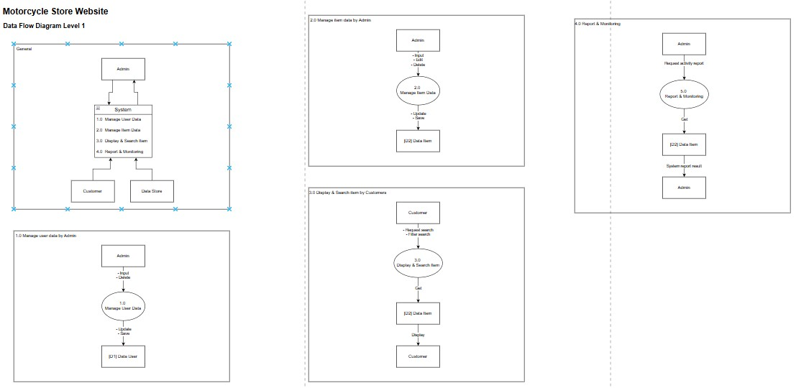
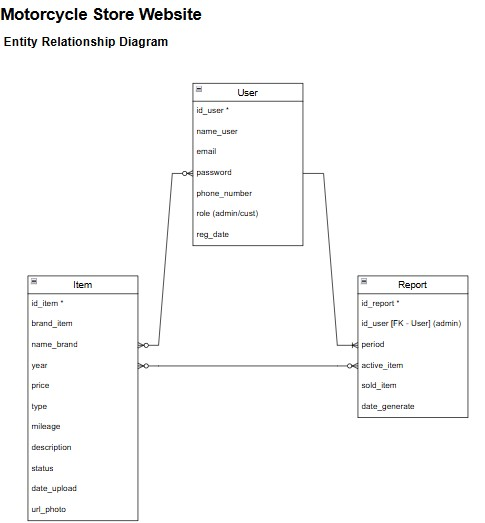

# 🏍️ Hype Bike – Used Motorcycle Sales Platform
Hype Bike is a web-based application designed to help used motorcycle dealers display and manage their inventory online.
This project was created as a system analysis simulation (System Analyst Portfolio), including process design (DFD), data relations (ERD), and UI prototyping in Figma.

---

## Project Objectives
Provide a used motorcycle sales platform with simple features for admins and customers:
- Admins can add, edit, and delete item inventory.
- Admins can set "Today's Offer" promotions on the main page.
- Customers can browse the motorcycle collection by brand and view motorcycle details.

---

## System Architecture and Design

### Data Flow Diagram (DFD)
Describes the data flow between the Admin, Customer, and the System.

📂 File: [`HypeBike_DFD.drawio`](./Used-Motorcycle-Sales-Platform/Motorcycle Store.drawio)

📸 DFD Level 0 Excerpt:

📸 DFD Level 1 Excerpt:

---

### Entity Relationship Diagram (ERD)
Shows the relationships between entities (User, Motorcycle, Promo, Log, etc.).

📂 File: [`HypeBike_ERD.drawio`](.Used-Motorcycle-Sales-Platform/Motorcycle Store.drawio)

📸 ERD Screenshot:

---

## 🎨 Design Prototype (Figma)
Interface preview.

🔗 **Figma Preview:** [Click here to view the design](https://www.figma.com/proto/1JhH28Q3xJuz7YPIVDlRTh/Used-Motor-Cycle?node-id=1-2&p=f&t=qwt91QnbRVrlxbUI-1&scaling=min-zoom&content-scaling=fixed&page-id=0%3A1&starting-point-node-id=1%3A2)

---
